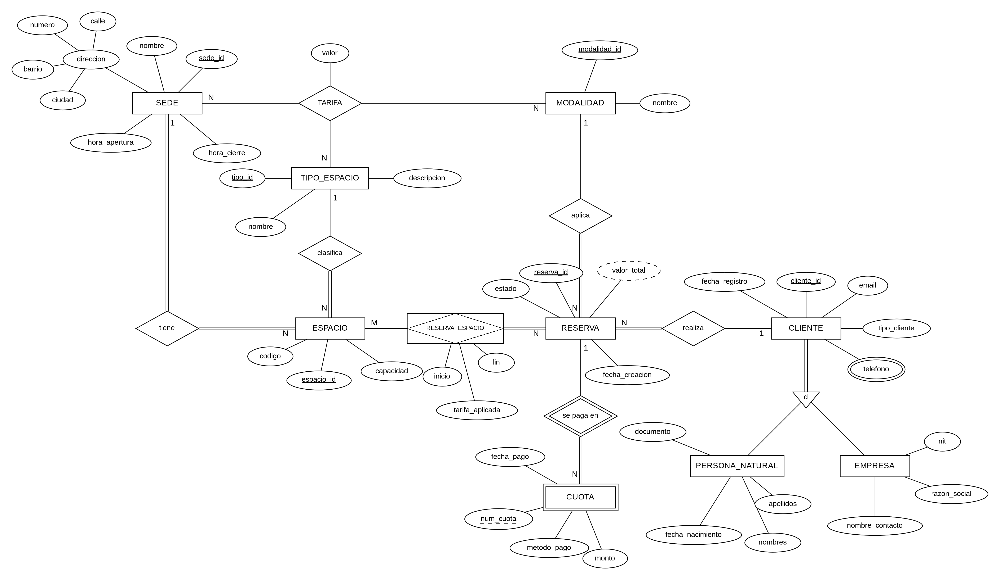

# Diagrama E/R en notación Chen

## Diagrama Entidad-Relación

*Figura 1. Diagrama E/R en notación Chen.*

---

## 1. Elementos del diagrama

| Elemento | Dónde está | Cómo se dibuja |
|---|---|---|
| Entidades fuertes | SEDE, TIPO_ESPACIO, MODALIDAD, ESPACIO, RESERVA, CLIENTE, PERSONA_NATURAL, EMPRESA | Rectángulo |
| Entidad débil | CUOTA. Depende de RESERVA y su llave parcial es `num_cuota` | Rectángulo doble |
| Relación identificadora | `se paga en`, entre RESERVA y CUOTA | Rombo doble |
| Entidad asociativa | RESERVA_ESPACIO. Resuelve la N:M y guarda `inicio`, `fin` y `tarifa_aplicada` | Rectángulo con rombo dentro |
| Relaciones 1:N | `tiene`, `clasifica`, `aplica`, `realiza` y `se paga en` | Rombo con 1 y N |
| Relación N:M | RESERVA y ESPACIO, a través de RESERVA_ESPACIO | M y N a cada lado |
| Relación ternaria | TARIFA, entre SEDE, TIPO_ESPACIO y MODALIDAD, con el atributo `valor` | Rombo unido a tres entidades |
| Atributo compuesto | `direccion` de SEDE: `calle`, `numero`, `barrio` y `ciudad` | Óvalo con óvalos hijos |
| Atributo multivaluado | `telefono` de CLIENTE. Un cliente puede tener varios | Óvalo doble |
| Atributo derivado | `valor_total` de RESERVA = suma de `tarifa_aplicada` × horas o días de cada espacio | Óvalo punteado |
| Especialización | CLIENTE se divide en PERSONA_NATURAL o EMPRESA (disjunta y total) | Triángulo con `d` |

El diagrama no tiene llaves foráneas. En Chen, la relación ya muestra la conexión: `tiene` indica a qué sede pertenece cada espacio, así que ESPACIO no lleva un óvalo `sede_id`.

---

## 2. Cardinalidad y participación

| Relación | Cardinalidad | Participación | Razón |
|---|---|---|---|
| SEDE tiene ESPACIO | 1:N | Total en ambos | Todo espacio está en una sede. Suponemos que no hay sedes vacías. |
| TIPO_ESPACIO clasifica ESPACIO | 1:N | Total en ESPACIO | Un tipo se puede crear antes de tener espacios. |
| MODALIDAD aplica a RESERVA | 1:N | Total en RESERVA | Toda reserva se cobra por hora o por día. |
| CLIENTE realiza RESERVA | 1:N | Total en RESERVA | Un cliente puede registrarse y no reservar nunca. |
| RESERVA – ESPACIO | N:M | Total en RESERVA | Toda reserva lleva al menos un espacio. Un espacio nuevo no tiene reservas. |
| RESERVA se paga en CUOTA | 1:N | Total en CUOTA | Una reserva recién hecha todavía no tiene pagos. |
| TARIFA | N:N:N | Parcial | Una sede no tiene que ofrecer todas las combinaciones. |

---

## 3. Por qué TARIFA es una relación ternaria

El caso dice que la tarifa de cada espacio depende de la sede. A eso se suma que un espacio se reserva por horas o por día, y el precio cambia según la modalidad.

El precio sale entonces de tres datos juntos:

- La sede.
- El tipo de espacio.
- La modalidad.

Una sala de juntas por hora en Chapinero tiene un precio, por día tiene otro, y en Usaquén por hora puede tener un tercero.

La cardinalidad se lee fijando dos lados.

Para una sede y un tipo puede haber varias modalidades.

Para una sede y una modalidad, varios tipos.

Para un tipo y una modalidad, varias sedes.

Los tres lados quedan en N, pero cada combinación tiene un solo valor.

No se puede partir en tres relaciones binarias. El valor no pertenece a ninguna pareja.

Además, las binarias pueden armar combinaciones falsas: dirían que Chapinero tiene salas, que las salas se cobran por hora y que Chapinero cobra por hora, aunque allá las salas solo se alquilen por día.

A esto se le llama **trampa de conexión**.

Elegimos ternaria y no recursiva porque en este caso ninguna entidad se relaciona de forma natural consigo misma.

MODALIDAD quedó como entidad para que la ternaria tenga sus tres participantes.

Si mañana se cobra por semana, basta con agregar una fila.

---

## 4. Débil y asociativa no son lo mismo

CUOTA depende de una sola entidad: `"cuota 2"` no dice nada sin su reserva.

RESERVA_ESPACIO existe para unir dos entidades en una relación N:M y tiene datos propios.

`tarifa_aplicada` guarda el precio del día de la reserva.

Si la tarifa sube después, la reserva conserva lo que se cobró.
