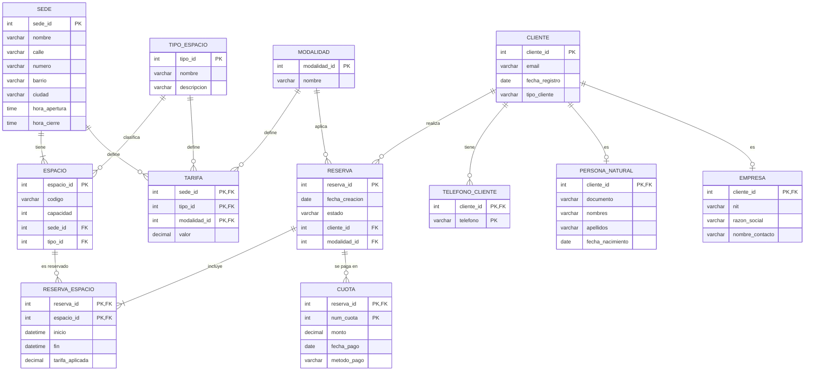

# Paso al modelo relacional

## Diagrama del modelo relacional



*Figura 2. Diagrama del modelo relacional.*

Este diagrama sale de pasar a tablas el diagrama E/R de la Figura 1 (`04_diagrama_er_chen.md`).

En Chen las conexiones se ven con rombos. En el modelo relacional ya no hay rombos: las conexiones se guardan con **llaves foráneas** dentro de las tablas.

---

## 1. Tablas del modelo

Las llaves primarias van <ins>subrayadas</ins> y las llaves foráneas en *cursiva*.

Si un atributo es parte de la llave primaria y también llave foránea, va <ins>*subrayado y en cursiva*</ins>.

| # | Tabla | Columnas | PK | FK |
|---|---|---|---|---|
| 1 | SEDE | <ins>sede_id</ins>, nombre, calle, numero, barrio, ciudad, hora_apertura, hora_cierre | sede_id | — |
| 2 | TIPO_ESPACIO | <ins>tipo_id</ins>, nombre, descripcion | tipo_id | — |
| 3 | MODALIDAD | <ins>modalidad_id</ins>, nombre | modalidad_id | — |
| 4 | ESPACIO | <ins>espacio_id</ins>, codigo, capacidad, *sede_id*, *tipo_id* | espacio_id | sede_id → SEDE; tipo_id → TIPO_ESPACIO |
| 5 | CLIENTE | <ins>cliente_id</ins>, email, fecha_registro, tipo_cliente | cliente_id | — |
| 6 | TELEFONO_CLIENTE | <ins>*cliente_id*</ins>, <ins>telefono</ins> | (cliente_id, telefono) | cliente_id → CLIENTE |
| 7 | PERSONA_NATURAL | <ins>*cliente_id*</ins>, documento, nombres, apellidos, fecha_nacimiento | cliente_id | cliente_id → CLIENTE |
| 8 | EMPRESA | <ins>*cliente_id*</ins>, nit, razon_social, nombre_contacto | cliente_id | cliente_id → CLIENTE |
| 9 | RESERVA | <ins>reserva_id</ins>, fecha_creacion, estado, *cliente_id*, *modalidad_id* | reserva_id | cliente_id → CLIENTE; modalidad_id → MODALIDAD |
| 10 | RESERVA_ESPACIO | <ins>*reserva_id*</ins>, <ins>*espacio_id*</ins>, inicio, fin, tarifa_aplicada | (reserva_id, espacio_id) | reserva_id → RESERVA; espacio_id → ESPACIO |
| 11 | CUOTA | <ins>*reserva_id*</ins>, <ins>num_cuota</ins>, monto, fecha_pago, metodo_pago | (reserva_id, num_cuota) | reserva_id → RESERVA |
| 12 | TARIFA | <ins>*sede_id*</ins>, <ins>*tipo_id*</ins>, <ins>*modalidad_id*</ins>, valor | (sede_id, tipo_id, modalidad_id) | sede_id → SEDE; tipo_id → TIPO_ESPACIO; modalidad_id → MODALIDAD |

---

## 2. De dónde sale cada tabla

Cada elemento del diagrama Chen se pasa con una regla distinta.

| Elemento del diagrama | Tabla que genera | Regla que se aplica |
|---|---|---|
| Entidades fuertes | SEDE, TIPO_ESPACIO, MODALIDAD, ESPACIO, CLIENTE, RESERVA | Cada entidad es una tabla. Su atributo clave es la PK |
| Atributo compuesto `direccion` | Ninguna nueva. Queda dentro de SEDE | Solo se guardan sus partes |
| Atributo multivaluado `telefono` | TELEFONO_CLIENTE | Sale a una tabla propia |
| Atributo derivado `valor_total` | Ninguna. No se guarda | Se calcula al consultar |
| Relaciones 1:N (`tiene`, `clasifica`, `aplica`, `realiza`) | Ninguna nueva. Agregan columnas a ESPACIO y RESERVA | La PK del lado 1 pasa al lado N como FK |
| Especialización de CLIENTE | PERSONA_NATURAL y EMPRESA | Una tabla por subclase, con la misma llave del cliente |
| Entidad asociativa RESERVA_ESPACIO | RESERVA_ESPACIO | Tabla con las llaves de las dos entidades que une |
| Entidad débil CUOTA | CUOTA | Llave del dueño + llave parcial |
| Relación identificadora `se paga en` | Ninguna nueva | Ya queda dentro de CUOTA |
| Relación ternaria TARIFA | TARIFA | Tabla con las llaves de las tres entidades |

En total quedan **12 tablas**:

- 6 de entidades fuertes.
- 2 de las subclases.
- 1 del atributo multivaluado.
- 1 de la entidad asociativa.
- 1 de la entidad débil.
- 1 de la relación ternaria.

---

## 3. Cómo se pasó cada elemento

### 3.1 Entidades fuertes

Cada entidad fuerte se vuelve una tabla.

Su atributo clave pasa a ser la llave primaria: `sede_id`, `tipo_id`, `modalidad_id`, `espacio_id`, `cliente_id` y `reserva_id`.

Sus atributos simples pasan como columnas. Por ejemplo, SEDE guarda `nombre`, `hora_apertura` y `hora_cierre`.

SEDE, TIPO_ESPACIO y MODALIDAD no tienen llaves foráneas.

Siempre están en el lado 1 de sus relaciones, así que no reciben llaves de nadie.

### 3.2 Atributo compuesto: `direccion`

En el diagrama, `direccion` es un óvalo con cuatro hijos: `calle`, `numero`, `barrio` y `ciudad`.

En la tabla no existe una columna `direccion`. Solo quedan sus cuatro partes.

Así cada columna guarda un solo dato.

Si la dirección fuera un solo texto, buscar las sedes de Bogotá obligaría a partir ese texto. Con `ciudad` aparte, basta con filtrar esa columna.

### 3.3 Atributo multivaluado: `telefono`

Un cliente puede tener varios teléfonos (supuesto 14).

No caben en una sola columna de CLIENTE. Una celda con dos números rompe la primera forma normal.

Por eso sale a su propia tabla: TELEFONO_CLIENTE.

Si el cliente 15 tiene dos números, la tabla queda así:

| cliente_id | telefono |
|---|---|
| 15 | 3104567890 |
| 15 | 6017654321 |

La llave es la pareja `(cliente_id, telefono)`.

`cliente_id` solo no sirve: se repite una vez por cada número.

`telefono` solo tampoco: no dice de quién es el número.

### 3.4 Atributo derivado: `valor_total`

En el diagrama, `valor_total` es un óvalo punteado. Eso significa que se calcula a partir de otros datos.

Por eso no se guarda como columna en RESERVA.

Se calcula con los espacios de la reserva: `tarifa_aplicada` por las horas o los días de cada espacio, y luego se suman.

```sql
SELECT re.reserva_id,
       SUM(re.tarifa_aplicada *
           CASE m.nombre
               WHEN 'Hora' THEN TIMESTAMPDIFF(HOUR, re.inicio, re.fin)
               ELSE DATEDIFF(re.fin, re.inicio) + 1
           END) AS valor_total
FROM RESERVA r
JOIN MODALIDAD m        ON m.modalidad_id = r.modalidad_id
JOIN RESERVA_ESPACIO re ON re.reserva_id  = r.reserva_id
GROUP BY re.reserva_id;
```

Si se guardara, habría que actualizarlo cada vez que se agrega o se quita un espacio de la reserva.

Si alguien olvida hacerlo, el total queda mal.

### 3.5 Relaciones 1:N

En una relación 1:N, la llave del lado 1 pasa al lado N como llave foránea.

| Relación | Lado 1 | Lado N | Columna que se agrega |
|---|---|---|---|
| `tiene` | SEDE | ESPACIO | `sede_id` en ESPACIO |
| `clasifica` | TIPO_ESPACIO | ESPACIO | `tipo_id` en ESPACIO |
| `aplica` | MODALIDAD | RESERVA | `modalidad_id` en RESERVA |
| `realiza` | CLIENTE | RESERVA | `cliente_id` en RESERVA |

La llave no puede ir al revés.

Una sede tiene muchos espacios. Si SEDE guardara `espacio_id`, tendría que guardar varios espacios en una sola celda.

En cambio, cada espacio está en una sola sede. Por eso ESPACIO guarda un único `sede_id`.

Las cuatro llaves foráneas son `NOT NULL`.

ESPACIO y RESERVA tienen participación total en esas relaciones: no hay espacio sin sede ni sin tipo, ni reserva sin cliente ni sin modalidad.

### 3.6 Especialización: CLIENTE, PERSONA_NATURAL y EMPRESA

En el diagrama, CLIENTE se divide en PERSONA_NATURAL o EMPRESA. Es disjunta y total: cada cliente es exactamente uno de los dos.

Se pasa con una tabla para el cliente y una para cada tipo.

CLIENTE guarda lo que tienen todos: `email`, `fecha_registro` y `tipo_cliente`.

PERSONA_NATURAL guarda `documento`, `nombres`, `apellidos` y `fecha_nacimiento`.

EMPRESA guarda `nit`, `razon_social` y `nombre_contacto`.

Las dos subclases usan como llave el mismo `cliente_id`. No inventan uno nuevo.

Ese `cliente_id` es a la vez su llave primaria y su llave foránea hacia CLIENTE.

Si el cliente 15 es una empresa, existe una fila con 15 en CLIENTE y otra con 15 en EMPRESA. En PERSONA_NATURAL no aparece.

`tipo_cliente` dice en cuál de las dos tablas buscar los datos.

Había otras dos formas de pasarlo:

| Alternativa | Por qué no se eligió |
|---|---|
| Una sola tabla CLIENTE con todas las columnas | Las empresas tendrían `documento` y `fecha_nacimiento` vacíos, y las personas tendrían `nit` y `razon_social` vacíos |
| Solo PERSONA_NATURAL y EMPRESA, sin CLIENTE | RESERVA tendría que apuntar a dos tablas distintas, y una llave foránea solo puede apuntar a una |

Con una tabla por clase, RESERVA y TELEFONO_CLIENTE apuntan siempre a CLIENTE, sin importar el tipo. Y no quedan columnas vacías.

### 3.7 Entidad asociativa: RESERVA_ESPACIO

Una reserva puede incluir varios espacios. Un espacio puede estar en varias reservas.

Ninguna de las dos tablas puede guardar la llave de la otra: las dos tendrían que guardar varias.

Por eso RESERVA_ESPACIO es una tabla aparte con las dos llaves.

Si la reserva 10 incluye una sala de juntas y dos escritorios, la tabla tiene tres filas con `reserva_id = 10`, una por espacio.

La llave es la pareja `(reserva_id, espacio_id)`. Un espacio aparece una sola vez dentro de cada reserva.

Sus datos propios quedan aquí:

- `inicio` y `fin`: cada espacio de la reserva puede usarse en un horario distinto. La sala de juntas puede ser de 9 a 11 y los escritorios de 9 a 6.
- `tarifa_aplicada`: el precio que se cobró ese día.

`tarifa_aplicada` parece repetir el `valor` de TARIFA, pero no es lo mismo.

TARIFA tiene el precio de hoy. `tarifa_aplicada` tiene el precio del día de la reserva.

Si la tarifa sube después, la reserva conserva lo que se cobró.

### 3.8 Entidad débil: CUOTA

Una cuota no se identifica sola. `"cuota 2"` no dice nada sin su reserva.

La cuota 1 de la reserva 10 y la cuota 1 de la reserva 11 son pagos distintos.

Por eso su llave es la llave de su reserva más su llave parcial: `(reserva_id, num_cuota)`.

| reserva_id | num_cuota | monto |
|---|---|---|
| 10 | 1 | 200000 |
| 10 | 2 | 150000 |
| 11 | 1 | 80000 |

`reserva_id` cumple dos papeles: es parte de la llave primaria y es llave foránea hacia RESERVA.

La relación identificadora `se paga en` no genera tabla. Ya queda representada dentro de CUOTA.

En el DDL se usará `ON DELETE CASCADE`: si se borra una reserva, sus cuotas se borran con ella.

### 3.9 Relación ternaria: TARIFA

TARIFA une tres entidades: SEDE, TIPO_ESPACIO y MODALIDAD.

Se pasa como una tabla con las tres llaves y el atributo `valor`.

| sede_id | tipo_id | modalidad_id | valor |
|---|---|---|---|
| Chapinero | Sala de juntas | Hora | 80000 |
| Chapinero | Sala de juntas | Día | 500000 |
| Usaquén | Sala de juntas | Hora | 95000 |

*(Se muestran los nombres para que se entienda. En la tabla real van los números de id.)*

La llave es la combinación de las tres: `(sede_id, tipo_id, modalidad_id)`.

Ninguna pareja alcanza:

- `(sede_id, tipo_id)` se repite: Chapinero + Sala de juntas tiene precio por hora y por día.
- `(sede_id, modalidad_id)` se repite: Chapinero + Hora tiene precio para salas y para escritorios.
- `(tipo_id, modalidad_id)` se repite: Sala de juntas + Hora tiene precio en Chapinero y en Usaquén.

Solo las tres juntas dicen a qué precio se refiere cada fila.

`valor` queda en esta tabla porque depende de las tres al mismo tiempo, no de una sola.

Las tres columnas son llaves foráneas: cada una apunta a la tabla de su entidad.

---

## 4. Lo que las llaves no alcanzan a cubrir

Las llaves primarias y foráneas no garantizan todas las reglas del diagrama.

Estas quedan para el DDL y los procedimientos del Corte 3:

| Regla | Por qué la llave no basta | Cómo se va a cumplir |
|---|---|---|
| `tipo_cliente` solo puede ser persona natural o empresa | Una columna de texto acepta cualquier valor | `CHECK (tipo_cliente IN ('NATURAL', 'EMPRESA'))` |
| `documento` y `nit` no se repiten | No son llave primaria | `UNIQUE` en cada uno |
| Cada cliente está en una sola subclase, la que dice `tipo_cliente` | Nada impide poner el mismo `cliente_id` en PERSONA_NATURAL y en EMPRESA | Procedimiento que crea el cliente y su subclase en la misma transacción |
| Toda sede tiene al menos un espacio | La FK obliga al espacio a tener sede, no a la sede a tener espacios | Procedimiento que crea la sede junto con su primer espacio |
| Toda reserva tiene al menos un espacio | Igual: la FK va de RESERVA_ESPACIO a RESERVA, no al revés | Transacción que guarda la reserva y sus espacios juntos, o nada |
| Un espacio no se cruza de horario (supuesto 6) | Dos filas con distinta reserva y el mismo espacio son válidas para la PK | Validación en el procedimiento de reserva |
| `fin` es después de `inicio` | Las llaves no comparan columnas | `CHECK (fin > inicio)` |
| Montos y tarifas positivos | Las llaves no revisan valores | `CHECK (monto > 0)`, `CHECK (valor > 0)` |
| Dos espacios de la misma sede no tienen el mismo código | `codigo` no es llave | `UNIQUE (sede_id, codigo)` |
| Una reserva nueva empieza pendiente | — | `DEFAULT 'PENDIENTE'` en `estado` |

---

## 5. Débil, asociativa y ternaria no se pasan igual

Las tres terminan en tablas con llave compuesta, pero por razones distintas.

| | CUOTA (débil) | RESERVA_ESPACIO (asociativa) | TARIFA (ternaria) |
|---|---|---|---|
| Cuántas entidades une | Depende de una | Une dos | Une tres |
| De qué está hecha su llave | Llave del dueño + `num_cuota` | Las dos llaves foráneas | Las tres llaves foráneas |
| Tiene una parte propia en la llave | Sí, `num_cuota` | No | No |
| Puede existir sola | No, necesita su reserva | No, necesita reserva y espacio | No, necesita las tres |

CUOTA tiene un dato propio en su llave porque una reserva tiene varias cuotas y hay que numerarlas.

RESERVA_ESPACIO y TARIFA no lo necesitan: la combinación de llaves ya identifica cada fila.
