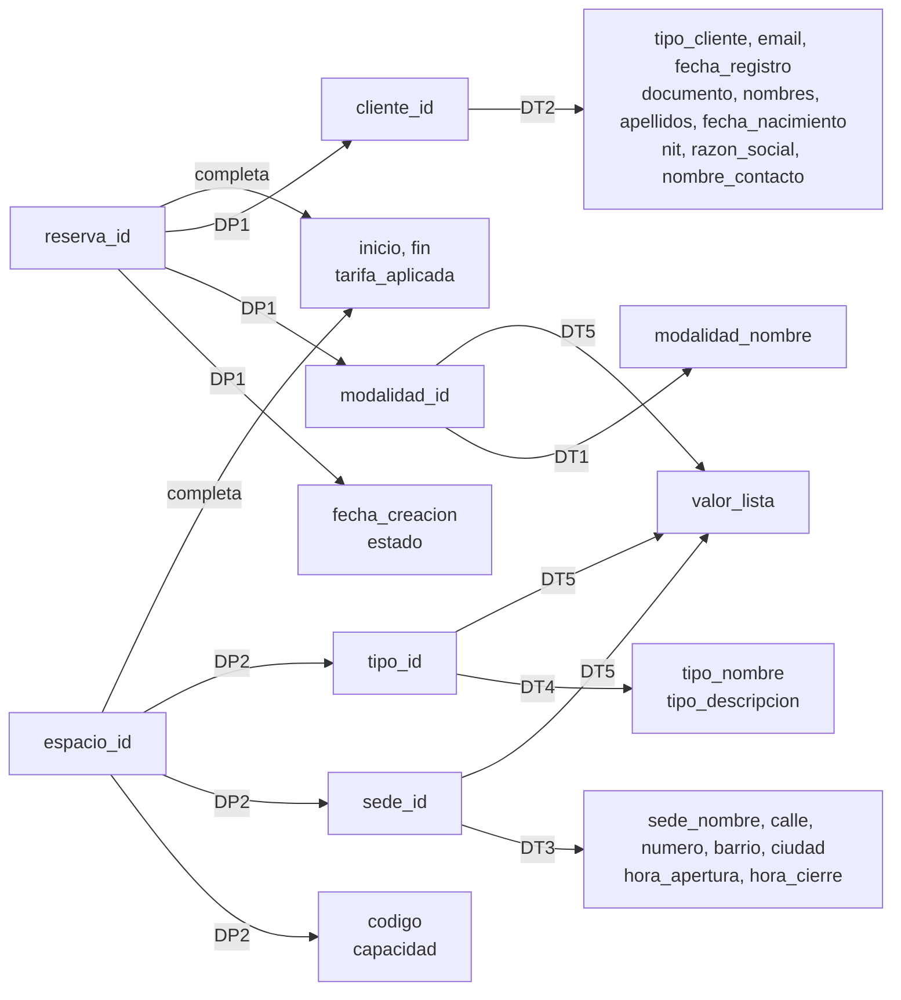

# Normalización hasta 3FN

Este documento muestra cómo se llega a las tablas del modelo relacional (`05_modelo_relacional.md`) aplicando normalización paso a paso.

La idea es comprobar el modelo por un segundo camino.

Persona 3 llegó a las tablas desde el diagrama E/R. Aquí se llega desde el otro lado: se parte de una sola planilla con todos los datos mezclados y se va partiendo hasta que no quede información repetida.

Si los dos caminos terminan en las mismas tablas, el modelo está bien hecho.

**Convenciones**

- `A → B` se lee "A determina a B": si dos filas tienen el mismo valor de A, tienen el mismo valor de B.
- **DF** = dependencia funcional, **DP** = dependencia parcial, **DT** = dependencia transitiva.
- Las llaves primarias van <ins>subrayadas</ins> y las llaves foráneas en *cursiva*, igual que en `05_modelo_relacional.md`.
- `{ }` marca un grupo que se repite y `( )` un atributo compuesto.

---

## 0. Las tres reglas

| Forma normal | Qué exige | Qué problema elimina |
|---|---|---|
| **1FN** | Cada celda guarda un solo valor. No hay grupos repetidos. Toda tabla tiene llave primaria | Listas dentro de una celda y columnas tipo `espacio1`, `espacio2`, `espacio3` |
| **2FN** | Estar en 1FN y que ningún atributo dependa de **solo una parte** de una llave compuesta | Dependencias parciales |
| **3FN** | Estar en 2FN y que ningún atributo no clave dependa de **otro atributo no clave** | Dependencias transitivas: `llave → X → Y`, donde X no es llave |

---

## 1. Esquema inicial sin normalizar

### 1.1 De dónde sale

Antes de tener base de datos, la recepción de una sede anotaría cada reserva en un formato como este.

Es el formato de la reserva 10 del ejemplo que usa Persona 3: una empresa reserva una sala de juntas y dos escritorios, y paga en dos cuotas.

```
RESERVA N.° 10                         Creada: 2026-03-02     Estado: CONFIRMADA
Modalidad: (2) Día                                         Valor total: $590.000
--------------------------------------------------------------------------------
CLIENTE N.° 15 · EMPRESA · registrado el 2026-02-10
Razón social: Andina Analytics S.A.S.             NIT: 901234567-8
Contacto: Laura Gómez                             Email: reservas@andinaanalytics.co
Teléfonos: 3104567890 · 6017654321
--------------------------------------------------------------------------------
ESPACIOS
[3] CH-SJ-01 · capacidad 10 · tipo (1) Sala de juntas
    Sede (1) Chapinero · Calle 63 # 9-45, Chapinero Alto, Bogotá · 07:00 a 21:00
    2026-03-05 08:00 → 2026-03-05 18:00 · tarifa de lista $500.000 · cobrada $450.000
[7] CH-ES-04 · capacidad 1 · tipo (2) Escritorio flexible
    Sede (1) Chapinero · Calle 63 # 9-45, Chapinero Alto, Bogotá · 07:00 a 21:00
    2026-03-05 08:00 → 2026-03-05 18:00 · tarifa de lista $70.000 · cobrada $70.000
[8] CH-ES-05 · capacidad 1 · tipo (2) Escritorio flexible
    Sede (1) Chapinero · Calle 63 # 9-45, Chapinero Alto, Bogotá · 07:00 a 21:00
    2026-03-05 08:00 → 2026-03-05 18:00 · tarifa de lista $70.000 · cobrada $70.000
--------------------------------------------------------------------------------
PAGOS
Cuota 1 · 2026-03-02 · $200.000 · Tarjeta de crédito
Cuota 2 · 2026-03-04 · $150.000 · Transferencia
```

La sala de juntas se cobró a $450.000 y no a los $500.000 de lista porque Andina Analytics tiene un convenio empresarial del 10 %.

Este detalle importa más adelante (sección 5.3).

### 1.2 El esquema

Si todo el formato se guarda como una sola tabla, el esquema queda así:

```
RESERVA_SN (
    reserva_id, fecha_creacion, estado, modalidad_id, modalidad_nombre, valor_total,
    cliente_id, tipo_cliente, email, fecha_registro, { telefono },
    documento, nombres, apellidos, fecha_nacimiento,
    nit, razon_social, nombre_contacto,
    { espacio_id, codigo, capacidad,
      tipo_id, tipo_nombre, tipo_descripcion,
      sede_id, sede_nombre, direccion(calle, numero, barrio, ciudad), hora_apertura, hora_cierre,
      inicio, fin, tarifa_aplicada, valor_lista },
    { num_cuota, monto, fecha_pago, metodo_pago }
)
```

Tiene todos los atributos del diagrama E/R (Figura 1).

Algunos nombres llevan prefijo (`sede_nombre`, `tipo_nombre`, `modalidad_nombre`) porque en una sola tabla no puede haber tres columnas llamadas `nombre`.

`valor_lista` es el precio publicado para esa sede, ese tipo de espacio y esa modalidad. En el diagrama E/R es el atributo `valor` de TARIFA.

`tarifa_aplicada` es lo que de verdad se le cobró al cliente en esa reserva.

Tiene tres problemas a la vista:

| Problema | Dónde |
|---|---|
| Atributo compuesto | `direccion` guarda calle, número, barrio y ciudad en un solo dato |
| Atributo multivaluado | `{ telefono }`: el cliente 15 tiene dos teléfonos |
| Grupos repetidos | `{ espacios }`: la reserva 10 tiene tres. `{ cuotas }`: la reserva 10 tiene dos |

Además tiene un atributo derivado, `valor_total`, que se puede calcular con otros datos.

### 1.3 Los datos de ejemplo

Estas son las cuatro reservas que se usan en todo el documento, vistas como la planilla sin normalizar.

Cada fila es una reserva. Las celdas con varias líneas tienen varios valores.

| reserva_id | fecha_creacion | modalidad | cliente_id | cliente | telefono | espacio_id | sede | tipo | tarifa_aplicada | num_cuota | monto |
|---|---|---|---|---|---|---|---|---|---|---|---|
| 10 | 2026-03-02 | Día | 15 | Andina Analytics S.A.S. | 3104567890<br>6017654321 | 3<br>7<br>8 | Chapinero<br>Chapinero<br>Chapinero | Sala de juntas<br>Escritorio flexible<br>Escritorio flexible | 450000<br>70000<br>70000 | 1<br>2 | 200000<br>150000 |
| 11 | 2026-05-10 | Hora | 22 | Santiago Rojas Pardo | 3157782190 | 12 | Usaquén | Sala de juntas | 95000 | 1 | 80000 |
| 12 | 2026-09-15 | Hora | 15 | Andina Analytics S.A.S. | 3104567890<br>6017654321 | 3 | Chapinero | Sala de juntas | 80000 | 1 | 240000 |
| 13 | 2026-09-22 | Día | 22 | Santiago Rojas Pardo | 3157782190 | 3 | Chapinero | Sala de juntas | 500000 | 1<br>2 | 250000<br>250000 |

*(Por espacio no caben todas las columnas. Las que faltan siguen el mismo patrón.)*

Datos de las dos sedes:

| sede_id | sede_nombre | calle | numero | barrio | ciudad | hora_apertura | hora_cierre |
|---|---|---|---|---|---|---|---|
| 1 | Chapinero | Calle 63 | 9-45 | Chapinero Alto | Bogotá | 07:00 | 21:00 |
| 2 | Usaquén | Carrera 7 | 119-14 | Usaquén | Bogotá | 06:00 | 22:00 |

### 1.4 Por qué esta tabla da problemas

Con solo cuatro reservas ya aparecen las tres anomalías clásicas.

**Anomalía de inserción.** No se puede guardar algo que todavía no tiene reserva.

- Una sede nueva, por ejemplo Cedritos, no se puede registrar hasta que alguien reserve allá.
- Un cliente que se registra hoy no queda guardado hasta que haga su primera reserva.
- La tarifa de escritorio por hora en Usaquén no tiene dónde quedar si nadie lo ha reservado.

**Anomalía de actualización.** Un mismo dato está escrito en muchas filas.

- Si Chapinero pasa a cerrar a las 22:00, hay que cambiarlo en cinco lugares: los tres espacios de la reserva 10, el de la 12 y el de la 13.
- Si se olvida uno, la base dice que Chapinero cierra a dos horas distintas.
- Lo mismo pasa con el email del cliente 15, escrito en las reservas 10 y 12.

**Anomalía de eliminación.** Al borrar una reserva se pierde información que no era de la reserva.

- La reserva 11 es la única donde aparece Usaquén.
- Si se borra, desaparecen la sede de Usaquén, el espacio 12 y la tarifa de sala de juntas por hora en esa sede.

---

## 2. Dependencias funcionales del caso

Antes de normalizar hay que saber qué determina a qué.

Cada dependencia sale de una regla del negocio, no de los datos de ejemplo. Los datos solo sirven para ilustrarla.

| # | Dependencia funcional | Regla del negocio que la justifica |
|---|---|---|
| DF1 | `reserva_id → fecha_creacion, estado, modalidad_id, cliente_id` | Una reserva se crea una vez, tiene un estado, se cobra con una sola modalidad (relación `aplica`, 1:N) y la hace un solo cliente (relación `realiza`, 1:N) |
| DF2 | `modalidad_id → modalidad_nombre` | Cada modalidad tiene un nombre: 1 = Hora, 2 = Día |
| DF3 | `cliente_id → tipo_cliente, email, fecha_registro, documento, nombres, apellidos, fecha_nacimiento, nit, razon_social, nombre_contacto` | Cada cliente tiene un solo registro con sus datos (supuesto 2) |
| DF4 | `espacio_id → codigo, capacidad, sede_id, tipo_id` | Cada espacio pertenece a una sola sede (supuesto 3) y tiene un solo tipo (relación `clasifica`, 1:N) |
| DF5 | `sede_id → sede_nombre, calle, numero, barrio, ciudad, hora_apertura, hora_cierre` | Cada sede está en un solo lugar y tiene un solo horario (supuesto 1) |
| DF6 | `tipo_id → tipo_nombre, tipo_descripcion` | Cada tipo de espacio tiene un nombre y una descripción |
| DF7 | `(sede_id, tipo_id, modalidad_id) → valor_lista` | El precio de lista depende de la sede, el tipo y la modalidad juntos (decisión de diseño 2 y relación ternaria TARIFA) |
| DF8 | `(reserva_id, espacio_id) → inicio, fin, tarifa_aplicada` | Cada espacio de una reserva tiene su propio horario y su propio precio cobrado |
| DF9 | `(reserva_id, num_cuota) → monto, fecha_pago, metodo_pago` | Cada cuota se identifica con su reserva y su número (supuestos 9 y 10) |

El teléfono no aparece en la tabla porque **no es una dependencia funcional**.

`cliente_id` no determina **un** teléfono: el cliente 15 tiene dos. Es un atributo multivaluado y se resuelve en la 1FN.

### 2.1 Dependencias que se revisaron y no se cumplen

Para no inventar dependencias, también se revisaron las que parecían posibles. Ninguna se cumple:

| ¿Se cumple…? | No, porque… | Consecuencia |
|---|---|---|
| `tipo_id → capacidad` | Dos salas de juntas pueden tener distinta capacidad: el espacio 3 es para 10 personas y el 12 para 8 | `capacidad` se queda en ESPACIO |
| `reserva_id → inicio, fin` | Dentro de una misma reserva la sala puede ser de 9 a 11 y los escritorios de 9 a 6 | `inicio` y `fin` van en RESERVA_ESPACIO, no en RESERVA |
| `(sede_id, tipo_id, modalidad_id) → tarifa_aplicada` | El espacio 3 (Chapinero, sala de juntas, día) se cobró $450.000 en la reserva 10 y $500.000 en la 13 | `tarifa_aplicada` no se va a TARIFA (sección 5.3) |
| `cliente_id → modalidad_id` | El cliente 15 reservó por día (reserva 10) y por hora (reserva 12) | La modalidad es de la reserva, no del cliente |
| `barrio → ciudad` | Hay barrios con el mismo nombre en distintas ciudades, por ejemplo "El Prado" en Bogotá y en Barranquilla | `barrio` y `ciudad` quedan juntos en SEDE sin separar |

### 2.2 Llaves candidatas

Algunos atributos también identifican una fila por sí solos. Se llaman **llaves candidatas**.

| Tabla | Llave candidata | Por qué |
|---|---|---|
| Espacio | `(sede_id, codigo)` | Dos espacios de la misma sede no tienen el mismo código |
| Persona natural | `documento` | Dos personas no tienen el mismo número de documento |
| Empresa | `nit` | Dos empresas no tienen el mismo NIT |

Una dependencia como `documento → nombres` **no** viola la 3FN, porque `documento` es llave candidata.

La 3FN solo prohíbe que un atributo dependa de otro que **no** es llave.

---

## 3. Primera forma normal (1FN)

**Regla:** cada celda guarda un solo valor, no hay grupos repetidos y la tabla tiene llave primaria.

RESERVA_SN no cumple. Se arregla en cinco pasos.

### Paso 1. El atributo derivado `valor_total` se retira

`valor_total` se calcula con los espacios de la reserva: `tarifa_aplicada` por las horas o los días de cada uno, y luego se suma.

Reserva 10: 450.000 + 70.000 + 70.000 = **$590.000**.

Esto no es una dependencia parcial ni transitiva. `reserva_id → valor_total` es una dependencia normal.

Se retira por otra razón: repite información que ya está en otras filas. Si se agrega un espacio a la reserva y nadie actualiza el total, el total queda mal.

Por eso no se guarda y se calcula al consultar, como lo explica `05_modelo_relacional.md`, sección 3.4.

### Paso 2. El atributo compuesto `direccion` se parte

`"Calle 63 # 9-45, Chapinero Alto, Bogotá"` se guarda en cuatro columnas: `calle`, `numero`, `barrio` y `ciudad`.

Así cada celda tiene un solo dato y se puede filtrar por ciudad sin tener que partir un texto.

### Paso 3. El atributo multivaluado `telefono` sale a su propia tabla

Una celda con `3104567890, 6017654321` rompe la 1FN.

Los teléfonos salen a una tabla nueva:

**TELEFONO_CLIENTE** ( <ins>*cliente_id*</ins>, <ins>telefono</ins> )

| cliente_id | telefono |
|---|---|
| 15 | 3104567890 |
| 15 | 6017654321 |
| 22 | 3157782190 |

La tabla lleva `cliente_id` y no `reserva_id` porque el teléfono es del cliente, no de la reserva.

Si llevara `reserva_id`, los dos teléfonos del cliente 15 se repetirían en las reservas 10 y 12.

### Paso 4. El grupo de cuotas sale a su propia tabla

**CUOTA** ( <ins>*reserva_id*</ins>, <ins>num_cuota</ins>, monto, fecha_pago, metodo_pago )

| reserva_id | num_cuota | monto | fecha_pago | metodo_pago |
|---|---|---|---|---|
| 10 | 1 | 200000 | 2026-03-02 | Tarjeta de crédito |
| 10 | 2 | 150000 | 2026-03-04 | Transferencia |
| 11 | 1 | 80000 | 2026-05-10 | PSE |
| 12 | 1 | 240000 | 2026-09-15 | Transferencia |
| 13 | 1 | 250000 | 2026-09-22 | Tarjeta de débito |
| 13 | 2 | 250000 | 2026-09-28 | Efectivo |

**¿Por qué no dejar cuotas y espacios en la misma tabla?**

Porque no tienen nada que ver entre sí. La cuota 1 de la reserva 10 no paga el espacio 7: paga una parte de la reserva completa.

Si se ponen en la misma tabla, cada espacio queda combinado con cada cuota. La reserva 10 tendría 3 espacios × 2 cuotas = 6 filas:

| reserva_id | espacio_id | num_cuota | monto |
|---|---|---|---|
| 10 | 3 | 1 | 200000 |
| 10 | 3 | 2 | 150000 |
| 10 | 7 | 1 | 200000 |
| 10 | 7 | 2 | 150000 |
| 10 | 8 | 1 | 200000 |
| 10 | 8 | 2 | 150000 |

Un `SUM(monto)` daría **$1.050.000** pagados, cuando en realidad se pagaron **$350.000**.

Por eso cada grupo repetido sale a su propia tabla, con la llave de la reserva más su propia llave.

### Paso 5. El grupo de espacios se vuelve una fila por espacio

Cada espacio de la reserva pasa a ser una fila. Los datos de la reserva se copian en cada una.

Ninguna columna sola identifica la fila: `reserva_id` se repite (la reserva 10 tiene tres filas) y `espacio_id` también (el espacio 3 está en las reservas 10, 12 y 13).

La llave es la pareja `(reserva_id, espacio_id)`.

### Resultado de la 1FN

**RESERVA_DETALLE** ( <ins>reserva_id</ins>, <ins>espacio_id</ins>, fecha_creacion, estado, modalidad_id, modalidad_nombre, cliente_id, tipo_cliente, email, fecha_registro, documento, nombres, apellidos, fecha_nacimiento, nit, razon_social, nombre_contacto, codigo, capacidad, tipo_id, tipo_nombre, tipo_descripcion, sede_id, sede_nombre, calle, numero, barrio, ciudad, hora_apertura, hora_cierre, inicio, fin, tarifa_aplicada, valor_lista )

**TELEFONO_CLIENTE** ( <ins>*cliente_id*</ins>, <ins>telefono</ins> )

**CUOTA** ( <ins>*reserva_id*</ins>, <ins>num_cuota</ins>, monto, fecha_pago, metodo_pago )

Así se ve RESERVA_DETALLE con los datos de ejemplo (solo algunas columnas):

| reserva_id | espacio_id | fecha_creacion | modalidad_nombre | cliente_id | email | sede_id | sede_nombre | hora_cierre | tipo_nombre | inicio | fin | tarifa_aplicada | valor_lista |
|---|---|---|---|---|---|---|---|---|---|---|---|---|---|
| 10 | 3 | 2026-03-02 | Día | 15 | reservas@andinaanalytics.co | 1 | Chapinero | 21:00 | Sala de juntas | 2026-03-05 08:00 | 2026-03-05 18:00 | 450000 | 500000 |
| 10 | 7 | 2026-03-02 | Día | 15 | reservas@andinaanalytics.co | 1 | Chapinero | 21:00 | Escritorio flexible | 2026-03-05 08:00 | 2026-03-05 18:00 | 70000 | 70000 |
| 10 | 8 | 2026-03-02 | Día | 15 | reservas@andinaanalytics.co | 1 | Chapinero | 21:00 | Escritorio flexible | 2026-03-05 08:00 | 2026-03-05 18:00 | 70000 | 70000 |
| 11 | 12 | 2026-05-10 | Hora | 22 | srojas.pardo@gmail.com | 2 | Usaquén | 22:00 | Sala de juntas | 2026-05-12 09:00 | 2026-05-12 11:00 | 95000 | 95000 |
| 12 | 3 | 2026-09-15 | Hora | 15 | reservas@andinaanalytics.co | 1 | Chapinero | 21:00 | Sala de juntas | 2026-09-21 14:00 | 2026-09-21 17:00 | 80000 | 80000 |
| 13 | 3 | 2026-09-22 | Día | 22 | srojas.pardo@gmail.com | 1 | Chapinero | 21:00 | Sala de juntas | 2026-09-28 08:00 | 2026-09-28 18:00 | 500000 | 500000 |

Ya cumple la 1FN: cada celda tiene un valor y hay llave primaria.

Pero sigue repitiendo mucho:

- Los datos del cliente 15 aparecen **4 veces** (tres filas de la reserva 10 y una de la 12).
- Los datos de Chapinero aparecen **5 veces**.
- `Día` aparece 4 veces y `Hora` 2.

Eso se ataca en la 2FN y la 3FN.

### Mapa de dependencias de RESERVA_DETALLE

Este diagrama muestra de qué depende cada atributo. Las flechas **DP** son dependencias parciales (se resuelven en la 2FN) y las **DT** son transitivas (se resuelven en la 3FN).



*Figura 3. Dependencias funcionales de RESERVA_DETALLE.*

CUOTA y TELEFONO_CLIENTE no aparecen en el mapa. En las secciones 4 y 5 se muestra que ya están normalizadas.

---

## 4. Segunda forma normal (2FN)

**Regla:** estar en 1FN y que ningún atributo no clave dependa de **solo una parte** de la llave primaria.

Solo puede fallar en tablas con llave compuesta. Si la llave tiene una sola columna, no hay "parte" de la cual depender.

### 4.1 Prueba atributo por atributo en RESERVA_DETALLE

La llave es `(reserva_id, espacio_id)`. Para cada atributo se pregunta: ¿basta con `reserva_id`? ¿basta con `espacio_id`? ¿o necesita los dos?

| Atributo | Lo determina | Evidencia en los datos |
|---|---|---|
| `fecha_creacion`, `estado` | Solo `reserva_id` | Las tres filas de la reserva 10 dicen 2026-03-02, sin importar el espacio |
| `modalidad_id`, `modalidad_nombre` | Solo `reserva_id` | Las tres filas de la reserva 10 dicen Día |
| `cliente_id` y todos los datos del cliente | Solo `reserva_id` | Las tres filas de la reserva 10 son del cliente 15 |
| `codigo`, `capacidad` | Solo `espacio_id` | El espacio 3 es CH-SJ-01 para 10 personas en las reservas 10, 12 y 13 |
| `tipo_id`, `tipo_nombre`, `tipo_descripcion` | Solo `espacio_id` | El espacio 3 siempre es sala de juntas |
| `sede_id` y todos los datos de la sede | Solo `espacio_id` | El espacio 3 siempre está en Chapinero |
| `inicio`, `fin` | Los dos | En la reserva 10 todos van de 08:00 a 18:00, pero el espacio 3 tiene otro horario en las reservas 12 y 13 |
| `tarifa_aplicada` | Los dos | Reserva 10: 450.000, 70.000 y 70.000 según el espacio. Espacio 3: 450.000, 80.000 y 500.000 según la reserva |
| `valor_lista` | Los dos | Espacio 3: 500.000 en la reserva 10 (por día) y 80.000 en la 12 (por hora). Reserva 10: 500.000 y 70.000 según el espacio |

`valor_lista` necesita los dos lados: del espacio sale la sede y el tipo, y de la reserva sale la modalidad.

Por eso no es dependencia parcial y sobrevive a la 2FN. Se resuelve en la 3FN (sección 5.3).

### 4.2 Dependencias parciales encontradas

**DP1:** `reserva_id → fecha_creacion, estado, modalidad_id, modalidad_nombre, cliente_id, tipo_cliente, email, fecha_registro, documento, nombres, apellidos, fecha_nacimiento, nit, razon_social, nombre_contacto`

Todo esto depende de la reserva, no del espacio. Por eso se repite en cada espacio de la misma reserva.

**DP2:** `espacio_id → codigo, capacidad, tipo_id, tipo_nombre, tipo_descripcion, sede_id, sede_nombre, calle, numero, barrio, ciudad, hora_apertura, hora_cierre`

Todo esto depende del espacio, no de la reserva. Por eso se repite cada vez que alguien reserva el mismo espacio.

*(En DP1 algunos atributos dependen de `reserva_id` a través de otro, por ejemplo `modalidad_nombre` a través de `modalidad_id`. Eso es una dependencia transitiva y se separa en la 3FN. Por ahora viajan juntos.)*

### 4.3 Cómo se resuelven

Cada dependencia parcial se saca a una tabla nueva:

1. La parte de la llave que causa la dependencia se vuelve la llave primaria de la tabla nueva.
2. Los atributos que dependen de ella se mueven a la tabla nueva.
3. Esa parte de la llave se queda en la tabla original como llave foránea, para no perder la conexión.

| Dependencia | Tabla nueva | Lo que queda en la tabla original |
|---|---|---|
| DP1 | RESERVA_2FN, con llave `reserva_id` | `reserva_id` como parte de la llave y FK |
| DP2 | ESPACIO_2FN, con llave `espacio_id` | `espacio_id` como parte de la llave y FK |

Lo que queda de RESERVA_DETALLE son los atributos que sí necesitan los dos: `inicio`, `fin`, `tarifa_aplicada` y `valor_lista`. Esa tabla es RESERVA_ESPACIO.

### 4.4 Resultado de la 2FN

**RESERVA_2FN** ( <ins>reserva_id</ins>, fecha_creacion, estado, modalidad_id, modalidad_nombre, cliente_id, tipo_cliente, email, fecha_registro, documento, nombres, apellidos, fecha_nacimiento, nit, razon_social, nombre_contacto )

**ESPACIO_2FN** ( <ins>espacio_id</ins>, codigo, capacidad, tipo_id, tipo_nombre, tipo_descripcion, sede_id, sede_nombre, calle, numero, barrio, ciudad, hora_apertura, hora_cierre )

**RESERVA_ESPACIO** ( <ins>*reserva_id*</ins>, <ins>*espacio_id*</ins>, inicio, fin, tarifa_aplicada, valor_lista )

**TELEFONO_CLIENTE** ( <ins>*cliente_id*</ins>, <ins>telefono</ins> ) — sin cambios

**CUOTA** ( <ins>*reserva_id*</ins>, <ins>num_cuota</ins>, monto, fecha_pago, metodo_pago ) — sin cambios

### 4.5 Las tablas que no cambiaron

**TELEFONO_CLIENTE** tiene llave compuesta, pero no tiene atributos fuera de la llave. No hay nada que pueda depender de una parte. Ya está en 2FN.

**CUOTA** tiene llave compuesta `(reserva_id, num_cuota)`. Se revisa:

- `reserva_id` solo no determina el monto: la reserva 10 tiene cuotas de 200.000 y 150.000.
- `num_cuota` solo tampoco: la cuota 1 vale 200.000 en la reserva 10 y 80.000 en la 11.

Los tres atributos necesitan la llave completa. Ya está en 2FN.

**RESERVA_2FN** y **ESPACIO_2FN** tienen llave de una sola columna, así que están en 2FN automáticamente.

### 4.6 Qué se ganó

| Antes (1FN) | Después (2FN) |
|---|---|
| Los datos del cliente 15 aparecen 4 veces | Aparecen 2 veces, una por reserva (10 y 12) |
| Los datos de Chapinero aparecen 5 veces | Aparecen 3 veces, una por espacio (3, 7 y 8) |

Mejoró, pero todavía se repite. El cliente 15 sigue escrito dos veces y Chapinero tres. Eso lo resuelve la 3FN.

---

## 5. Tercera forma normal (3FN)

**Regla:** estar en 2FN y que ningún atributo no clave dependa de otro atributo no clave.

El patrón que se busca es `llave → X → Y`, donde X **no** es llave. En ese caso Y depende de la llave solo "de rebote", a través de X.

Se resuelve igual que en la 2FN: X se vuelve la llave de una tabla nueva, Y se va con ella y X se queda en la tabla original como llave foránea.

### 5.1 RESERVA_2FN

**DT1:** `reserva_id → modalidad_id → modalidad_nombre`

`modalidad_nombre` no es un dato de la reserva: es el nombre de la modalidad. Las reservas 10 y 13 escriben "Día" cada una. Si alguien escribe "Diario" en una, la base tendría dos nombres para la misma modalidad.

Se resuelve con **MODALIDAD** ( <ins>modalidad_id</ins>, nombre ).

**DT2:** `reserva_id → cliente_id → tipo_cliente, email, fecha_registro, documento, nombres, apellidos, fecha_nacimiento, nit, razon_social, nombre_contacto`

Los datos del cliente no son de la reserva. Por eso el cliente 15 aparece en las reservas 10 y 12 con todos sus datos repetidos.

Se resuelve con **CLIENTE** ( <ins>cliente_id</ins>, tipo_cliente, email, fecha_registro, documento, nombres, apellidos, fecha_nacimiento, nit, razon_social, nombre_contacto ).

Lo que queda:

**RESERVA** ( <ins>reserva_id</ins>, fecha_creacion, estado, *cliente_id*, *modalidad_id* )

Se revisa que no quede nada transitivo: `estado` no determina `fecha_creacion` ni al revés, y ninguno determina al cliente. Está en 3FN.

### 5.2 ESPACIO_2FN

**DT3:** `espacio_id → sede_id → sede_nombre, calle, numero, barrio, ciudad, hora_apertura, hora_cierre`

La dirección y el horario son de la sede, no del espacio. Por eso Chapinero aparece tres veces, una por cada espacio que tiene.

Se resuelve con **SEDE** ( <ins>sede_id</ins>, nombre, calle, numero, barrio, ciudad, hora_apertura, hora_cierre ).

**DT4:** `espacio_id → tipo_id → tipo_nombre, tipo_descripcion`

El nombre y la descripción son del tipo. Los espacios 7 y 8 repiten "Escritorio flexible" con su descripción.

Se resuelve con **TIPO_ESPACIO** ( <ins>tipo_id</ins>, nombre, descripcion ).

Lo que queda:

**ESPACIO** ( <ins>espacio_id</ins>, codigo, capacidad, *sede_id*, *tipo_id* )

Se revisa lo que queda:

- `capacidad` se queda. No depende del tipo: el espacio 3 y el 12 son salas de juntas con capacidad 10 y 8 (sección 2.1).
- `(sede_id, codigo) → espacio_id` sí se cumple, pero `(sede_id, codigo)` es llave candidata (sección 2.2). No es transitiva. En el DDL se garantiza con `UNIQUE (sede_id, codigo)`.

Está en 3FN.

### 5.3 RESERVA_ESPACIO: el caso de la tarifa

Este es el caso más interesante, porque la dependencia transitiva cruza las dos partes de la llave.

**DT5:** `(reserva_id, espacio_id) → (sede_id, tipo_id, modalidad_id) → valor_lista`

Se arma así:

- Del `espacio_id` salen `sede_id` y `tipo_id` (DF4).
- Del `reserva_id` sale `modalidad_id` (DF1).
- Y las tres juntas determinan `valor_lista` (DF7).

`(sede_id, tipo_id, modalidad_id)` no es llave de RESERVA_ESPACIO. Por eso `valor_lista` depende de la llave solo a través de ellas: es transitiva.

En la 2FN no se detectó porque no depende de **una** parte de la llave sino de las dos, cada una aportando un pedazo.

**El problema en los datos:**

| reserva_id | espacio_id | sede | tipo | modalidad | valor_lista |
|---|---|---|---|---|---|
| 10 | 3 | Chapinero | Sala de juntas | Día | 500000 |
| 13 | 3 | Chapinero | Sala de juntas | Día | 500000 |
| 10 | 7 | Chapinero | Escritorio flexible | Día | 70000 |
| 10 | 8 | Chapinero | Escritorio flexible | Día | 70000 |

- El mismo precio se repite cada vez que alguien reserva la misma combinación.
- Si Chapinero sube el escritorio por día a $75.000, hay que cambiar todas las filas de escritorios por día en Chapinero.
- La tarifa de escritorio por hora en Usaquén ($18.000) no se puede guardar, porque nadie lo ha reservado.

Se resuelve con **TARIFA** ( <ins>*sede_id*</ins>, <ins>*tipo_id*</ins>, <ins>*modalidad_id*</ins>, valor ):

| sede_id | tipo_id | modalidad_id | valor |
|---|---|---|---|
| 1 (Chapinero) | 1 (Sala de juntas) | 1 (Hora) | 80000 |
| 1 (Chapinero) | 1 (Sala de juntas) | 2 (Día) | 500000 |
| 1 (Chapinero) | 2 (Escritorio flexible) | 2 (Día) | 70000 |
| 2 (Usaquén) | 1 (Sala de juntas) | 1 (Hora) | 95000 |
| 2 (Usaquén) | 2 (Escritorio flexible) | 1 (Hora) | 18000 |

Cada precio queda escrito una sola vez. La última fila ya se puede guardar aunque nadie haya reservado ese escritorio.

**Esta tabla es exactamente la relación ternaria TARIFA del diagrama E/R.** La normalización llega a ella por su cuenta, lo que confirma la decisión de diseño 2.

`valor_lista` sale de RESERVA_ESPACIO. Si se necesita, se obtiene uniendo las tablas (sección 7.1).

**¿Y `tarifa_aplicada`? ¿No es lo mismo?**

No. Es la pregunta más importante de esta sección.

Si `tarifa_aplicada` dependiera de `(sede_id, tipo_id, modalidad_id)`, también sería transitiva y habría que sacarla. Pero esa dependencia **no se cumple**:

| reserva_id | espacio_id | sede | tipo | modalidad | valor_lista | tarifa_aplicada |
|---|---|---|---|---|---|---|
| 10 | 3 | Chapinero | Sala de juntas | Día | 500000 | **450000** |
| 13 | 3 | Chapinero | Sala de juntas | Día | 500000 | **500000** |

Misma sede, mismo tipo, misma modalidad, y dos precios cobrados distintos.

La reserva 10 tuvo el descuento del convenio empresarial. También pasa cuando la tarifa sube: las reservas viejas conservan el precio con el que se hicieron.

`tarifa_aplicada` es un hecho de esa reserva y ese espacio. Depende de la llave completa y de nada más.

Si se moviera a TARIFA, subir un precio hoy cambiaría lo que el cliente 15 pagó en marzo. Por eso se queda.

Lo que queda:

**RESERVA_ESPACIO** ( <ins>*reserva_id*</ins>, <ins>*espacio_id*</ins>, inicio, fin, tarifa_aplicada )

`inicio`, `fin` y `tarifa_aplicada` dependen de la llave completa y no dependen entre sí. Está en 3FN.

### 5.4 CLIENTE

Después de DT2 la tabla queda así:

**CLIENTE** ( <ins>cliente_id</ins>, tipo_cliente, email, fecha_registro, documento, nombres, apellidos, fecha_nacimiento, nit, razon_social, nombre_contacto )

**¿Hay dependencias transitivas?**

- `documento → nombres, apellidos, fecha_nacimiento`: se cumple, pero `documento` es llave candidata (sección 2.2). No viola la 3FN.
- `nit → razon_social, nombre_contacto`: mismo caso, `nit` es llave candidata.

La tabla **ya está en 3FN**. Pero tiene otro problema, que la 3FN no detecta:

| cliente_id | tipo_cliente | email | documento | nombres | apellidos | fecha_nacimiento | nit | razon_social | nombre_contacto |
|---|---|---|---|---|---|---|---|---|---|
| 15 | EMPRESA | reservas@andinaanalytics.co | NULL | NULL | NULL | NULL | 901234567-8 | Andina Analytics S.A.S. | Laura Gómez |
| 22 | NATURAL | srojas.pardo@gmail.com | 1020745332 | Santiago | Rojas Pardo | 1996-08-14 | NULL | NULL | NULL |

Cada fila deja vacía casi la mitad de las columnas.

Por eso se aplica la **especialización** del diagrama E/R (CLIENTE se divide en PERSONA_NATURAL o EMPRESA, disjunta y total):

**CLIENTE** ( <ins>cliente_id</ins>, email, fecha_registro, tipo_cliente )

**PERSONA_NATURAL** ( <ins>*cliente_id*</ins>, documento, nombres, apellidos, fecha_nacimiento )

**EMPRESA** ( <ins>*cliente_id*</ins>, nit, razon_social, nombre_contacto )

Esta división **no la exige la 3FN**: la tabla con nulos ya estaba en 3FN. La exige el diseño E/R y sirve para no tener columnas vacías.

Las tres tablas siguen en 3FN y se vuelven a unir sin perder nada por `cliente_id`. Es la misma conclusión de `05_modelo_relacional.md`, sección 3.6.

### 5.5 Las tablas que ya estaban en 3FN

**CUOTA:** `monto`, `fecha_pago` y `metodo_pago` no dependen entre sí. Dos cuotas pagadas por transferencia tienen montos distintos (150.000 y 240.000), y el método no depende de la fecha.

**TELEFONO_CLIENTE:** no tiene atributos fuera de la llave. No puede tener dependencias transitivas.

### 5.6 Resumen de lo que se resolvió en cada paso

| Problema | Tipo | Se resolvió en | Tabla que generó |
|---|---|---|---|
| `valor_total` | Atributo derivado | 1FN, paso 1 | Ninguna, se calcula al consultar |
| `direccion` | Atributo compuesto | 1FN, paso 2 | Ninguna, queda partida en SEDE |
| `telefono` | Atributo multivaluado | 1FN, paso 3 | TELEFONO_CLIENTE |
| Grupo de cuotas | Grupo repetido | 1FN, paso 4 | CUOTA |
| Grupo de espacios | Grupo repetido | 1FN, paso 5 | RESERVA_DETALLE, que luego se vuelve RESERVA_ESPACIO |
| DP1: `reserva_id → datos de la reserva` | Dependencia parcial | 2FN | RESERVA |
| DP2: `espacio_id → datos del espacio` | Dependencia parcial | 2FN | ESPACIO |
| DT1: `modalidad_id → modalidad_nombre` | Dependencia transitiva | 3FN | MODALIDAD |
| DT2: `cliente_id → datos del cliente` | Dependencia transitiva | 3FN | CLIENTE |
| DT3: `sede_id → datos de la sede` | Dependencia transitiva | 3FN | SEDE |
| DT4: `tipo_id → datos del tipo` | Dependencia transitiva | 3FN | TIPO_ESPACIO |
| DT5: `(sede_id, tipo_id, modalidad_id) → valor_lista` | Dependencia transitiva | 3FN | TARIFA |
| Columnas vacías en CLIENTE | No es de forma normal: viene de la especialización | Después de 3FN | PERSONA_NATURAL y EMPRESA |
